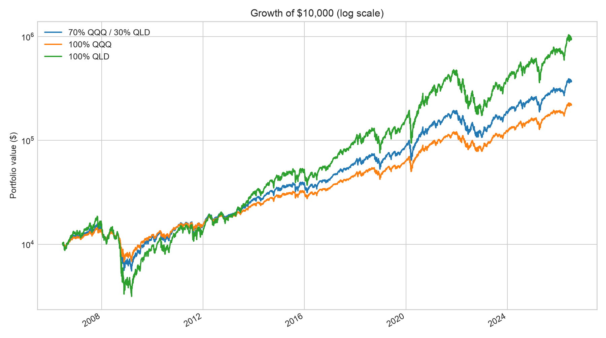
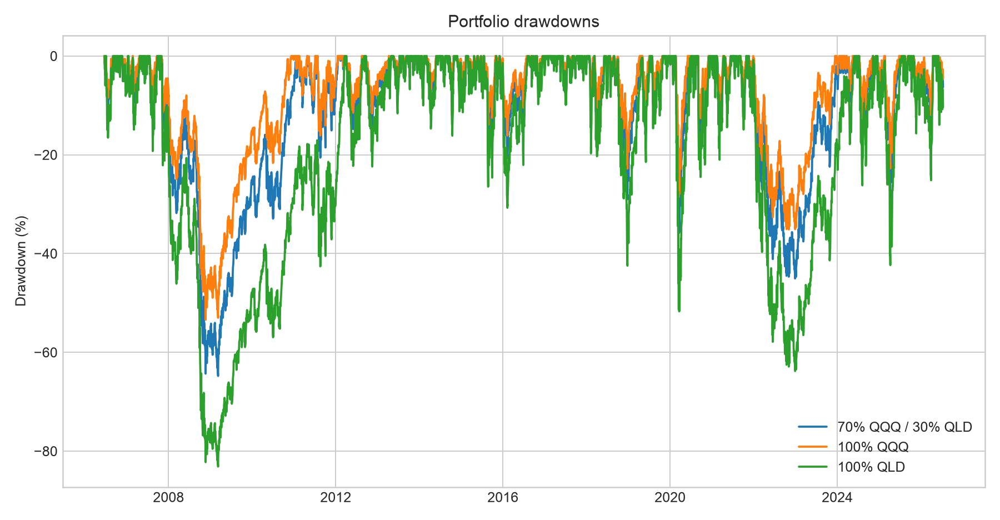
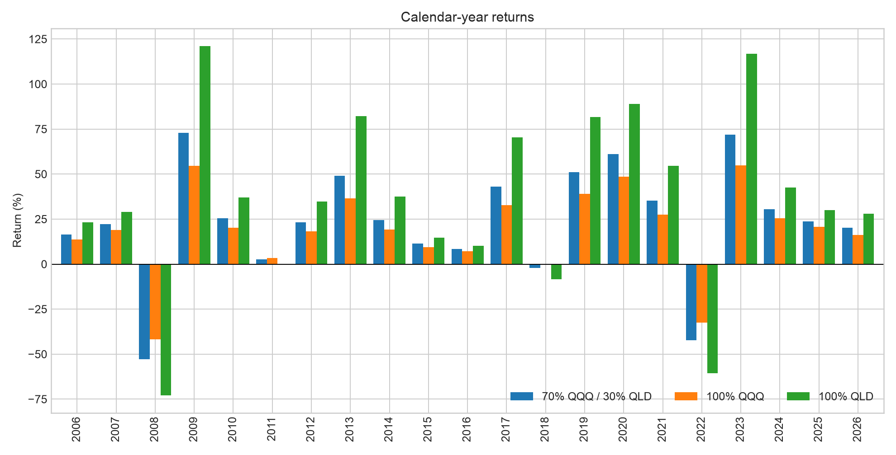

# 70% QQQ / 30% QLD Backtest

This directory contains the dedicated, reproducible backtest for the author's stated allocation: **70% QQQ and 30% QLD**. It is a leveraged Nasdaq-100 position with an approximate target daily exposure of **1.30x**, not a diversified stock/bond portfolio.

## Assumptions

- Full common history: 2006-06-20 through 2026-07-13 (5,046 daily returns)
- Rebalancing: `ME` (month-end)
- One-way turnover cost: 2.0 bps
- Dividends and fund expenses are reflected in the adjusted price series where available
- No taxes, bid/ask spread, account restrictions, or investor cash flows

## Full-period result

A $10,000 initial investment grew to approximately **$367,960**. The strategy returned **19.7% CAGR** with **28.5% annualized volatility** and a **-64.8% maximum drawdown**.

| strategy          | cagr   | volatility   |   sharpe |   sortino | max_drawdown   |   calmar | terminal_multiple   |
|:------------------|:-------|:-------------|---------:|----------:|:---------------|---------:|:--------------------|
| 70% QQQ / 30% QLD | 19.7%  | 28.5%        |     0.78 |      0.98 | -64.8%         |     0.3  | 36.8x               |
| 100% QQQ          | 16.7%  | 22.1%        |     0.81 |      1.08 | -53.4%         |     0.31 | 21.9x               |
| 100% QLD          | 25.4%  | 44.0%        |     0.74 |      0.82 | -83.1%         |     0.31 | 93.5x               |

## Calendar-year breakdown

The best calendar year was **2009** (72.9%); the worst was **2008** (-52.9%).

The complete table is available in [`results/calendar_year_returns.csv`](results/calendar_year_returns.csv).

## Largest drawdown episodes

| peak_date   | trough_date   | recovery_date   | max_drawdown   |   trading_days_to_trough |   total_trading_days |
|:------------|:--------------|:----------------|:---------------|-------------------------:|---------------------:|
| 2007-10-31  | 2009-03-09    | 2011-02-08      | -64.8%         |                      339 |                  824 |
| 2021-11-19  | 2022-12-28    | 2024-01-19      | -45.1%         |                      277 |                  542 |
| 2020-02-19  | 2020-03-16    | 2020-06-08      | -35.9%         |                       18 |                   76 |
| 2018-08-29  | 2018-12-24    | 2019-04-22      | -29.0%         |                       80 |                  160 |
| 2024-12-16  | 2025-04-08    | 2025-06-26      | -28.9%         |                       76 |                  130 |
| 2015-12-01  | 2016-02-09    | 2016-07-28      | -20.7%         |                       47 |                  165 |
| 2011-07-26  | 2011-08-19    | 2012-01-19      | -20.6%         |                       18 |                  122 |
| 2015-07-20  | 2015-08-25    | 2015-10-28      | -17.8%         |                       26 |                   71 |
| 2024-07-10  | 2024-08-07    | 2024-11-07      | -17.5%         |                       20 |                   85 |
| 2020-09-02  | 2020-09-23    | 2020-12-03      | -16.3%         |                       14 |                   64 |

## Charts







## Reproduce

Run from the repository root:

```bash
.venv/bin/python backtests/qqq70_qld30/run_backtest.py
```

Generated files:

- `results/summary_metrics.csv`
- `results/calendar_year_returns.csv`
- `results/monthly_returns.csv`
- `results/largest_drawdowns.csv`
- `assets/equity_curve.png`
- `assets/drawdowns.png`
- `assets/calendar_year_returns.png`

## Risk notice

QLD seeks 2x the **daily** Nasdaq-100 return. Daily reset, volatility, financing costs, fees, and path dependence can make long-horizon results differ substantially from a constant 1.30x index investment. Historical results are not a forecast. This research is for reference only and is not financial advice.
