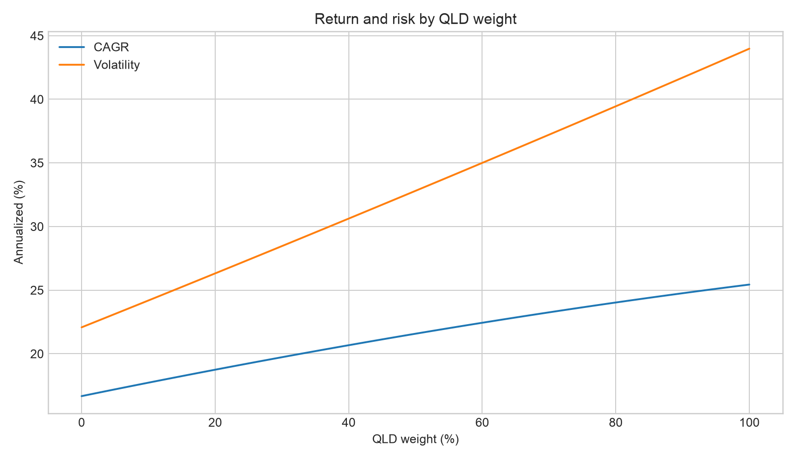
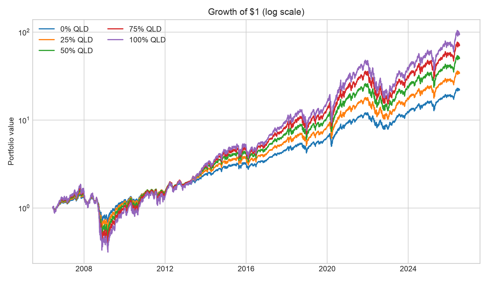
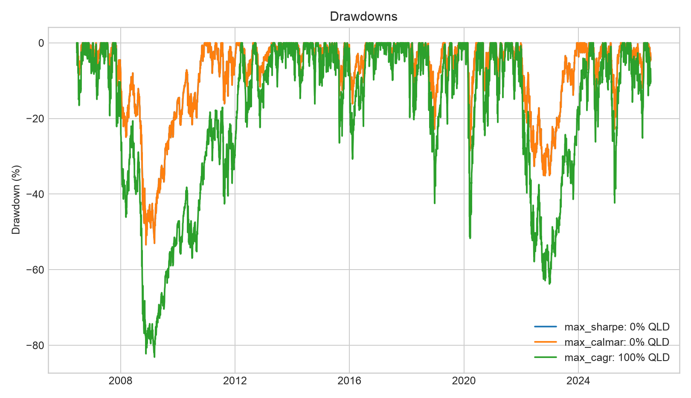
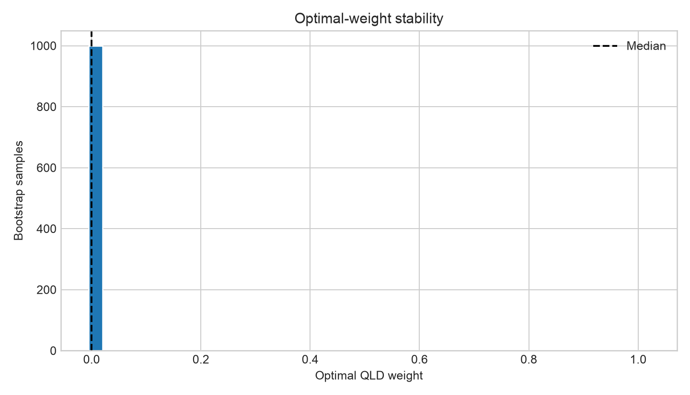

# QQQ + QLD Empirical Results

> Data window: 2006-06-20 through 2026-07-13;
> ME rebalancing; one-way turnover cost: 2.0 bps.
> The sample covers QLD's full common live history. The pre- and post-2022 data segments are validated over their overlap and linked at the splice date.

## Bottom line

The historical evidence does not support a universally optimal QQQ/QLD mix. Both funds track the same index, so combining them primarily selects a daily exposure between approximately 1x and 2x rather than adding diversification.
Maximizing in-sample CAGR drives the allocation to 100% QLD, while maximizing Sharpe or Calmar drives it to 100% QQQ. Intermediate weights become meaningful when the investor specifies a volatility target or drawdown constraint.

## The optimal allocation depends on the objective

| Objective | QQQ | QLD | Effective daily exposure | CAGR | Volatility | Maximum drawdown | Sharpe |
|---|---:|---:|---:|---:|---:|---:|---:|
| Maximum in-sample CAGR | 0% | 100% | 2.00x | 25.4% | 44.0% | -83.1% | 0.74 |
| Maximum in-sample Sharpe | 100% | 0% | 1.00x | 16.7% | 22.1% | -53.4% | 0.81 |
| Maximum in-sample Calmar | 100% | 0% | 1.00x | 16.7% | 22.1% | -53.4% | 0.81 |
| Closest to 25% volatility | 86% | 14% | 1.14x | 18.1% | 25.0% | -58.8% | 0.79 |
| Maximum CAGR with drawdown no worse than -60% | 84% | 16% | 1.16x | 18.3% | 25.5% | -59.6% | 0.79 |

## Out-of-sample performance and stability

The expanding-window walk-forward strategy produced an out-of-sample CAGR of **19.1%**, a Sharpe ratio of **0.95**, and a maximum drawdown of **-35.1%**.
For each test year, the highest-Sharpe weight is selected using only information that was previously available, making this result more realistic than a full-sample optimum.

Across the moving-block bootstrap samples, the median highest-Sharpe QLD weight is **0%**, with a 5th–95th percentile range of **0%–0%**. A wider interval indicates that the exact optimal percentage is less stable.

## Interpretation limits

The practical appeal of QQQ plus QLD is that two liquid ETFs can continuously adjust target daily Nasdaq-100 exposure from approximately 1x to 2x.
However, the funds track the same index and do not diversify across asset classes. QLD resets daily, so long-horizon results depend on path, volatility, financing, fees, and tracking error.
The table reports estimates for this historical window and these assumptions. It is not a forecast, a guarantee, or personalized investment advice.

## Charts

## Walk-forward annual selections

| test_start   | test_end   |   selected_weight_qld |    cagr |   volatility |   sharpe |   sortino |   max_drawdown |   calmar |   terminal_multiple |
|:-------------|:-----------|----------------------:|--------:|-------------:|---------:|----------:|---------------:|---------:|--------------------:|
| 2011-01-03   | 2011-12-30 |                0.0000 |  0.0348 |       0.2370 |   0.2626 |    0.2028 |        -0.1610 |   0.2159 |              1.0348 |
| 2012-01-03   | 2012-12-31 |                0.0000 |  0.1827 |       0.1533 |   1.1712 |    1.8219 |        -0.1164 |   1.5698 |              1.1811 |
| 2013-01-02   | 2013-12-31 |                0.0000 |  0.3663 |       0.1223 |   2.6140 |    4.5927 |        -0.0585 |   6.2580 |              1.3663 |
| 2014-01-02   | 2014-12-31 |                0.0000 |  0.1918 |       0.1383 |   1.3383 |    1.9676 |        -0.0825 |   2.3253 |              1.1918 |
| 2015-01-02   | 2015-12-31 |                0.0000 |  0.0944 |       0.1787 |   0.5937 |    0.7548 |        -0.1394 |   0.6769 |              1.0944 |
| 2016-01-04   | 2016-12-30 |                0.0000 |  0.0710 |       0.1617 |   0.5048 |    0.6052 |        -0.1204 |   0.5896 |              1.0710 |
| 2017-01-03   | 2017-12-29 |                0.0000 |  0.3281 |       0.1032 |   2.8040 |    4.7202 |        -0.0488 |   6.7219 |              1.3266 |
| 2018-01-02   | 2018-12-31 |                0.0000 | -0.0013 |       0.2289 |   0.1087 |   -0.0075 |        -0.2280 |  -0.0056 |              0.9987 |
| 2019-01-02   | 2019-12-31 |                0.0000 |  0.3896 |       0.1619 |   2.1143 |    3.5271 |        -0.1098 |   3.5474 |              1.3896 |
| 2020-01-02   | 2020-12-31 |                0.0000 |  0.4839 |       0.3563 |   1.2876 |    1.8997 |        -0.2856 |   1.6944 |              1.4862 |
| 2021-01-04   | 2021-12-31 |                0.0000 |  0.2742 |       0.1822 |   1.4216 |    2.1879 |        -0.1085 |   2.5268 |              1.2742 |
| 2022-01-03   | 2022-12-30 |                0.0000 | -0.3268 |       0.3215 |  -1.0699 |   -1.3842 |        -0.3483 |  -0.9383 |              0.6742 |
| 2023-01-03   | 2023-12-29 |                0.0000 |  0.5540 |       0.1787 |   2.5582 |    5.0766 |        -0.1078 |   5.1386 |              1.5485 |
| 2024-01-02   | 2024-12-31 |                0.0000 |  0.2558 |       0.1801 |   1.3552 |    2.0257 |        -0.1356 |   1.8865 |              1.2558 |
| 2025-01-02   | 2025-12-31 |                0.0000 |  0.2095 |       0.2360 |   0.9225 |    1.3327 |        -0.2277 |   0.9200 |              1.2077 |
| 2026-01-02   | 2026-07-13 |                0.0000 |  0.3334 |       0.2142 |   1.4505 |    2.2967 |        -0.1172 |   2.8432 |              1.1613 |
